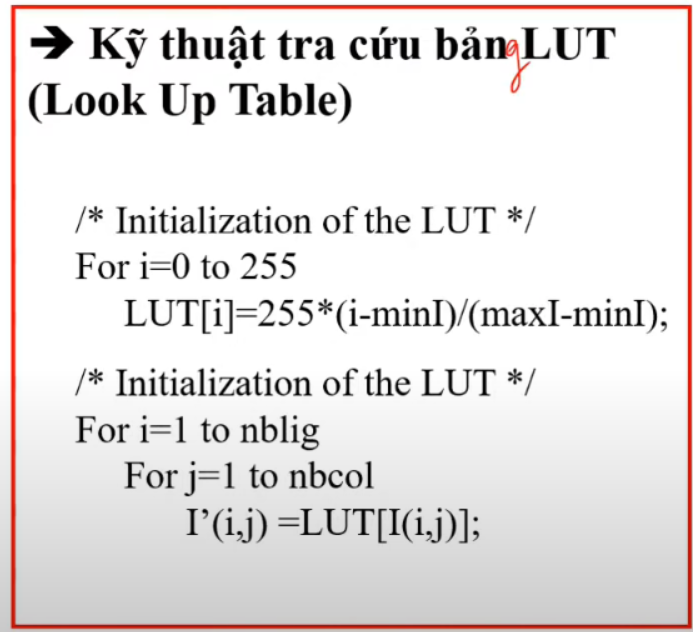
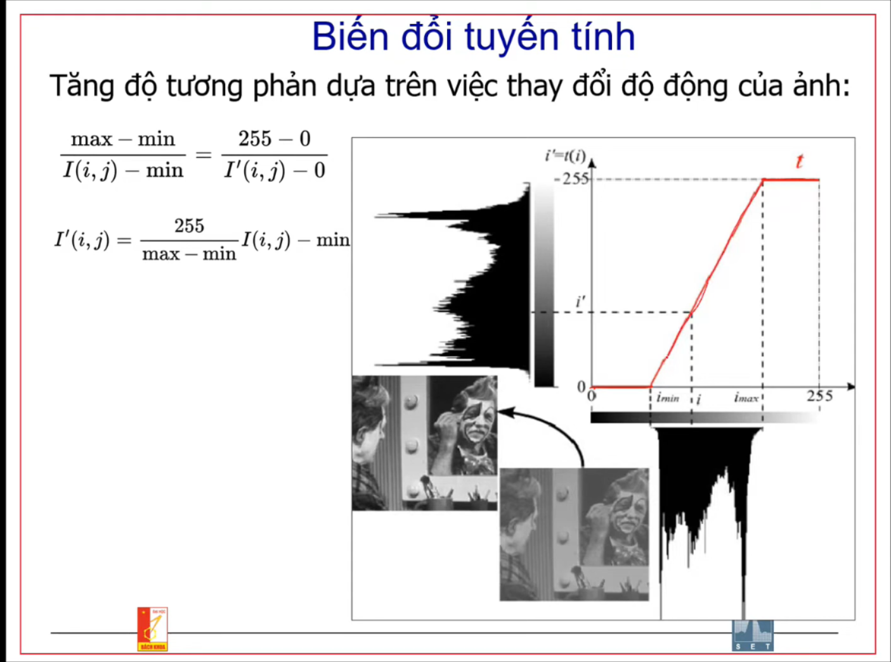

## Distance
1. Euclip
2. Chessboard
3. City block

## Biểu đồ tần suất
- Histogram
- Viet thuat toan histogram
1. Ưu
   - Tính nhanh (O(n^2))
2. Nhược
   - Đánh mất tính không gian

## Color place
1. Mắt người
   - Cell hình que: nhận diện màu đa mức xám
   - Cell hình nón: Nhận diện màu sắc 
2. Subtractive color space
3. Additive color space
4. HSV
   - H(hue): Màu sắc
   - S(Saturation): Độ đậm đặc, sự bão hòa
   - V(Value): Giá trị cường độ

## Biến đổi tuyến tính
   - 
   - 