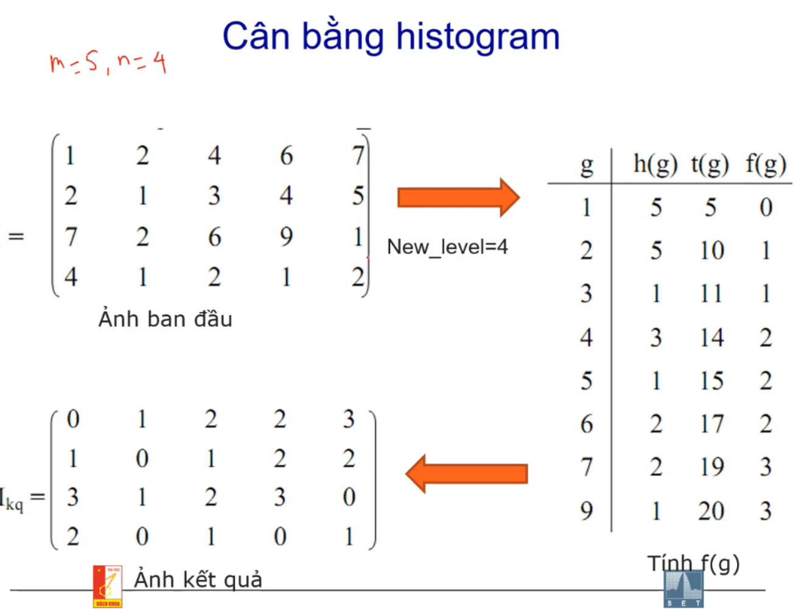
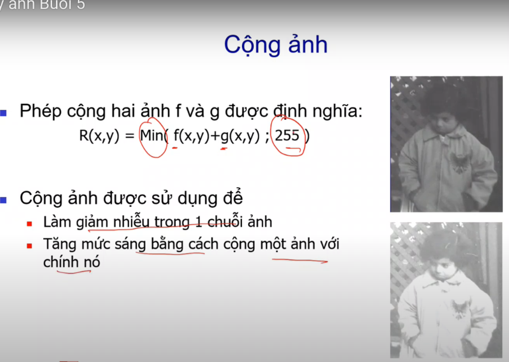
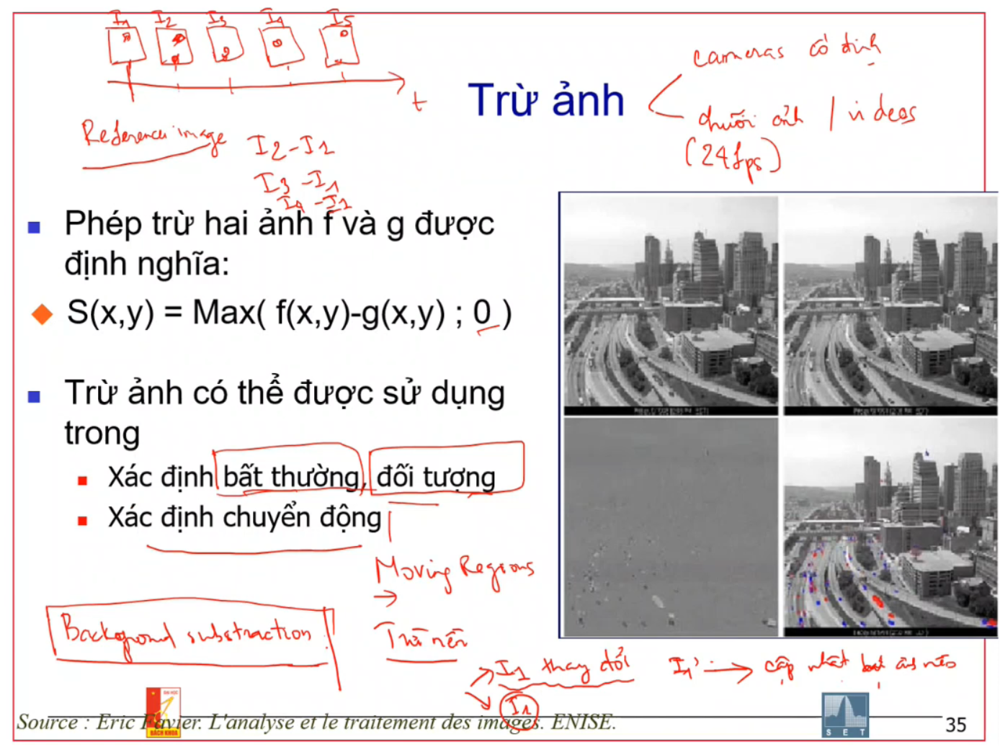
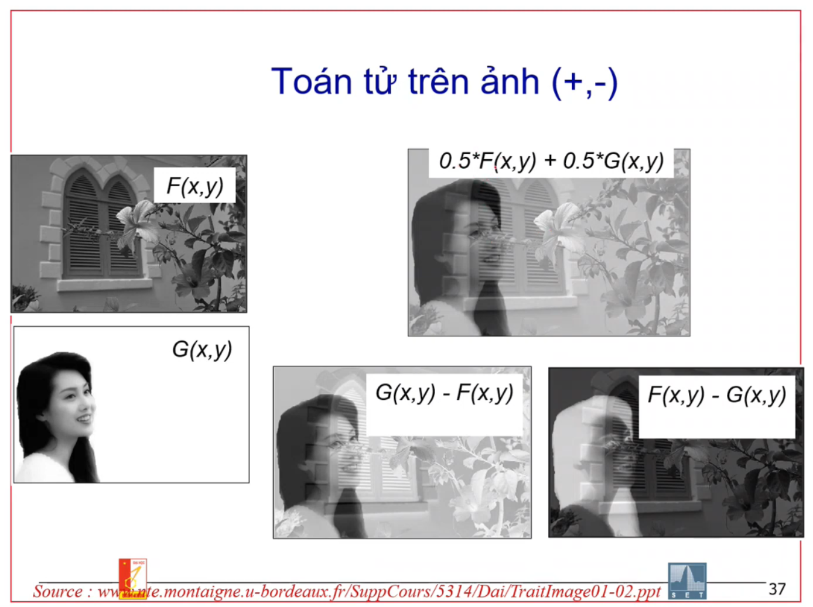
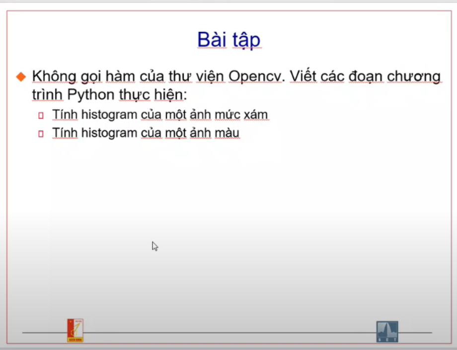

## Cân bằng ảnh

1. Cân bằng histogram
   

2. Cộng ảnh
   

3. Trừ ảnh
    - Làm việc với chuỗi ảnh, video
    - Làm việc với camera cố định
    - 24fps
   

4. Nhân ảnh
   

5. Toán tử trên ảnh

   

6. Bài tập

   